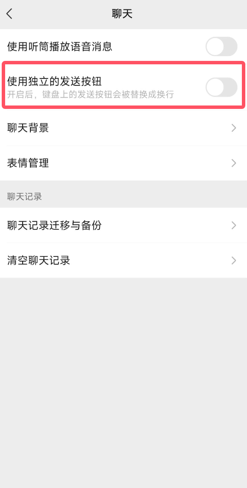

# dummy-wxbot

用笨办法实现的微信小bot，采用Webhook消息推送 + ADB自动化实现。

_PS: 技术上来说，这种方法可应用于任何聊天软件。_

## 需要安装的安卓软件

必须安装：
- [SmSForwarder](https://github.com/pppscn/SmsForwarder): 用于转发通知到Webhook
- [ADBKeyBoard](https://github.com/senzhk/ADBKeyBoard): 需要借助它实现自动化中文输入，因为`adb shell input text`不能输入中文，此外，需要在微信中关闭回车换行，即让回车变为发送消息

可选安装:
- [EasyTier](https://github.com/EasyTier/EasyTier)：用于内网穿透

## 使用该项目

1. 大模型接入的是[GPTGod](https://gptgod.site/)的服务，在项目根目录创建`.env`文件，填入大语言模型的token即可：
```dotenv
token=xxxx
```

2. 启动`src/webhook.py`
3. 到**SmSForwarder**配置Webhook，指向你自己的webhook，注意**消息模板的配置**


4. **SmSForwarder**配置消息转发规则： 当App包名是：`com.tencent.mm`时转发到webhook，注意**自定义模板的配置**


5. 使用`adb`无线连接到安卓手机
6. 切换输入法至**ADBKeyBoard**，将微信打开到你要进行交互的对话框，然后点击输入框，记得提前设置关闭回车换行，即让回车变为发送消息




5. 重点！！发送消息前一定要将窗口切回到**SmSForwarder**，然后一切准备就绪，这时可以开始交互了

## 使用Termux实现脱离PC端部署

1. 在termux安装android-tools，用于连接本机adb
```shell
pkg install android-tools
```

然后按正常流程:
- adb配对设备：`adb pair IP:PORT`
- adb连接设备: `adb connect IP:PORT`

2. 在Termux安装python
```shell
pkg install python
```

3. 将本项目拷贝或克隆至termux的home目录: `/data/data/com.termux/files/home`
> [!WARNING]
> 1. 不要使用子目录，创建虚拟环境会报`permission denied`
> 2. 手机上我没有使用poetry，而是用传统的pip，因为poetry在termux这个环境比较麻烦，所以直接用pip

4. cd到项目目录中，创建虚拟环境
```shell
cd /data/data/com.termux/files/home/dummy-wxbot
python -m venv ./venv
```
5. 进入Python虚拟环境
```shell
source venv/bin/activate

# fish
source venv/bin/activate.fish
```

6. pip安装依赖
```shell
pip install flask dotenv requests
```

7. 启动webhook.py
```shell
python src/webhook.py
```

## 交互

使用`/help`查看指令列表。

## 演示

https://github.com/user-attachments/assets/e75611f7-8ce1-497c-ae88-25c961777393

## 开源证书

[MIT 证书](./LICENSE.md)

Copyright (C) 2025-present Vincent-the-gamer
